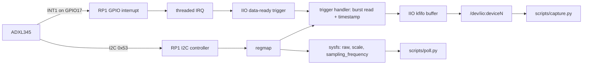

# rpi-iio-driver

An interrupt-driven Linux IIO driver for the ADXL345 accelerometer on a Raspberry Pi 5, written from scratch as a learning project, with a device tree overlay, triggered-buffer capture, measured benchmarks against userspace polling, and a minimal Buildroot image.

The driver is called `adxl345_learn`. It is not the mainline ADXL345 driver and does not try to replace it. It exists to show the full path from a sensor on an I2C bus to timestamped samples in userspace, with every claim below backed by a saved log in `docs/results/`.

## What it does

- Out-of-tree I2C driver in C using `regmap` and `devm_` resource management
- Bound through a device tree overlay (`rpi,adxl345-learn`), with INT1 described as a level-triggered interrupt
- Three acceleration channels with `scale`, a writable `sampling_frequency` and the list of available rates
- Data-ready IIO trigger and triggered buffer: one burst read per interrupt, three axes from the same sample, kernel timestamp on every record
- Raw sysfs reads refused with `EBUSY` while the buffer is running, so a stray read cannot steal a sample
- Sensor returned to standby with interrupts disabled on unbind
- `checkpatch.pl --strict` clean: 0 errors, 0 warnings, 0 checks
- Minimal Buildroot image (cross-compiled) in which the driver is loaded at boot by modalias

## How the pieces fit



## Hardware

| ADXL345 pin | Raspberry Pi 5 header |
|---|---|
| VCC | pin 1 (3.3 V) |
| GND | pin 6 |
| SDA | pin 3 |
| SCL | pin 5 |
| INT1 | pin 11 (GPIO17) |
| CS | 3.3 V (selects I2C) |
| SDO | GND (address 0x53) |

## Repository layout

| Path | Contents |
|---|---|
| `driver/` | `adxl345_learn.c`, `Kbuild`, `Makefile` |
| `overlay/` | Overlay for this driver, and one for the mainline driver (comparison only) |
| `scripts/` | `capture.py` (buffered capture and statistics), `poll.py` (polled baseline), `capture_mainline.py`, `stress.sh` |
| `buildroot/` | Buildroot external tree: configuration, driver package, boot files, image script |
| `docs/results/` | Raw output of every benchmark quoted below |

## Build and run on Raspberry Pi OS

Developed and measured on Raspberry Pi OS Lite 64-bit, kernel `6.18.50+rpt-rpi-2712`. The driver uses IIO interfaces from recent kernels and will not build on 6.12.

`/boot/firmware/config.txt` needs:

```
dtparam=i2c_arm=on
dtparam=i2c_arm_baudrate=400000
```

Build the module and the overlay:

```bash
sudo apt install raspberrypi-kernel-headers device-tree-compiler
cd driver && make && cd ..
cd overlay
dtc -@ -I dts -O dtb -o adxl345-learn.dtbo adxl345-learn-overlay.dts
sudo cp adxl345-learn.dtbo /boot/firmware/overlays/
cd ..
```

`dtc` prints warnings about `reg` and default `#address-cells`. They are expected: the overlay deliberately leaves out the bus properties that already exist in the base tree, because setting them again makes the kernel log a "memory leak" warning every time the overlay is applied at run time.

Load, capture, unload:

```bash
sudo modprobe industrialio-triggered-buffer
sudo modprobe regmap-i2c
sudo insmod driver/adxl345_learn.ko
sudo dtoverlay adxl345-learn
sudo python3 scripts/capture.py --rate 100 --samples 1000
sudo dtoverlay -r adxl345-learn
sudo rmmod adxl345_learn
```

Raspberry Pi OS ships the older input-subsystem driver (`adxl34x`), which claims the compatible string `adi,adxl345`. That is why this driver uses its own string.

## Results

Conditions for all results: Raspberry Pi 5, otherwise idle, sensor stationary, kernel 6.18.50. Loss is detected from gaps between kernel timestamps (a gap over 1.5 times the median interval), because samples carry no sequence number. The first 5 samples of each run are left out of the timing statistics; see "Start-up transient" below.

### The sensor's real output rate

The ADXL345 runs from its own oscillator. On this part it produced about 98.1% of the nominal rate at every setting (98.12 to 98.18 Hz at "100 Hz", 785 Hz at "800 Hz"). Rates below are given as nominal and measured.

### Sustained capture

| Run | Result |
|---|---|
| 10 minutes at 800 Hz nominal, 400 kHz bus, final driver | Pending re-run |
| 10 minutes at 800 Hz nominal, 100 kHz bus, earlier driver revision | 470,000 samples at 785.161 Hz, 0 gaps, interval standard deviation 0.7 µs (`long_800hz_100khz.txt`) |
| 100 load/unload cycles, final driver | Pending re-run. On the earlier revision: 100 probes, 0 warning or error lines in the kernel log |

The earlier revision differed only in how capture start-up is handled.

### Maximum rate, interrupt-driven against polled (10-second runs)

| I2C bus speed | Interrupt-driven buffer | Polled sysfs reads |
|---|---|---|
| 100 kHz | 800 Hz nominal (785 Hz) with 0 gaps; ceiling about 1142 Hz | 400 Hz sustained; ceiling about 651 Hz |
| 400 kHz | 3200 Hz nominal (3143 Hz) with 0 gaps, the sensor's maximum | 1600 Hz with 26 of 16,000 deadlines missed; ceiling about 2287 Hz |

The 100 kHz ceiling matches the time one six-byte burst read takes on the wire (about 0.875 ms). Raising the bus to 400 kHz moved the ceiling, which confirms the bus was the bottleneck. Polling is slower because each sample costs three bus transactions instead of one.

The 1600 and 3200 Hz results show that every interrupt was serviced on time. The ADXL345 datasheet advises against output rates above 800 Hz on I2C, and data integrity at those rates was not verified.

### CPU time per sample (10-second runs)

Measured from the scheduler's exact per-thread run time (`/proc/<pid>/schedstat`) for the Python reader plus the driver's interrupt thread.

| Bus | Rate (nominal) | Interrupt-driven | Polled | Reduction |
|---|---|---|---|---|
| 100 kHz | 100 Hz | 28.5 µs | 57.4 µs | 50% |
| 100 kHz | 200 Hz | 22.7 µs | 54.2 µs | 58% |
| 100 kHz | 400 Hz | 20.7 µs | 52.3 µs | 60% |
| 400 kHz | 800 Hz | 21.5 µs | 50.4 µs | 57% |
| 400 kHz | 1600 Hz | 20.1 µs | 53.0 µs | 62% |

In absolute terms both approaches are cheap on a Pi 5: under about 2% of one core at 100 kHz bus rates that both can sustain.

### Timing

Interval standard deviation was between 0.4 and 1.5 µs, and minimum and maximum intervals stayed within about 6 µs of the mean in every 10-second run. Polled timing from userspace was similarly tight at low rates, so no jitter improvement is claimed.

Interrupt-to-data latency (INT1 pulse width on an oscilloscope): not yet measured.

### Buildroot image

| Item | Value |
|---|---|
| Buildroot | 2026.02.3 (LTS), Bootlin prebuilt toolchain |
| Kernel | Raspberry Pi 6.18.55, commit `af73e0836bf0` |
| SD card image | 185 MB (64 MB boot, 120 MB root partition) |
| Root filesystem contents | 37 MB |
| Kernel image | 25 MB |
| Driver bound after kernel start | 1.95 s |
| Modules loaded at idle | 41 |
| Build time | about 20 minutes on a 20-core laptop under WSL2 |

## Comparison with the mainline IIO driver

Raspberry Pi OS does not build the mainline IIO ADXL345 driver, so the unmodified source from the `rpi-6.18.y` branch was built out of tree and bound with `overlay/adxl345-mainline-overlay.dts`. It uses the sensor's hardware FIFO with a watermark interrupt and has no timestamp channel, so only throughput could be compared.

On this board it delivered a fraction w/(w+1) of the sensor's samples for watermark w:

| Watermark | Measured rate at 100 Hz nominal | 98.14 Hz × w/(w+1) |
|---|---|---|
| 1 | 49.07 Hz | 49.07 |
| 2 | 65.42 Hz | 65.43 |
| 8 | 87.19 Hz | 87.24 |
| 16 | 92.29 Hz | 92.37 |

Register tracing (regmap trace events) showed the driver reading exactly the entry count the chip reported, with the overrun bit clear and no FIFO reset between interrupts. Two hypotheses were ruled out that way. The root cause was not established: it may be the driver's FIFO handling, or this particular breakout board, which may carry a clone chip. This is recorded as an observation on one board, not as a defect in the mainline driver.

## Things found along the way

- **Start-up transient.** When capture starts, a data-ready flag is usually already pending, so the first interrupt fires at once. The driver reads and discards that sample. When one bus read takes a large part of the sample period (800 Hz on a 100 kHz bus), the next few timestamps can still be late by less than one read time while the capture catches up. The capture tool leaves the first 5 samples out of the statistics and prints that it did; `--skip 0` shows the raw behaviour.
- **Tick-based CPU accounting is biased here.** `/proc/stat` reported 0.00% CPU for the polling loop, below the idle baseline, because a task that wakes on a timer can fall between accounting ticks. All CPU figures above use exact scheduler run time instead.
- **Module loading on a minimal image.** The first Buildroot image loaded the driver but never bound it, because nothing loaded the I2C controller driver. The image now uses BusyBox mdev to load modules from device modalias strings, so both the controller and this driver load because the device tree asks for them.

## Limitations

- Timestamps are taken in the interrupt thread, so they include the kernel's scheduling delay.
- If an I2C read fails in the handler, the level-triggered line stays asserted and the interrupt re-fires; the driver only logs a rate-limited error.
- Fixed ±2 g full-resolution range. No calibration offsets, events, power management or SPI support.
- The scale is the datasheet's nominal 3.9 mg per count. On this board the measured magnitude at rest was about 15% above 1 g, so absolute values are uncalibrated.
- CPU figures come from single 10-second runs, include the Python reader, and exclude time in the I2C controller's hard interrupt handler.
- Results come from one board and one sensor.
- The Buildroot image loads a driver for every device in the tree (41 modules). A product image would build only what it needs.
- The Buildroot kernel (6.18.55) is a few stable releases newer than the kernel the benchmarks ran on (6.18.50).

## Reproducing the Buildroot image

On a Linux host or WSL2, with the build inside the Linux filesystem:

```bash
sudo apt install build-essential git wget cpio unzip rsync bc file libncurses-dev libssl-dev python3
git clone --depth 1 --branch 2026.02.3 https://gitlab.com/buildroot.org/buildroot.git
git clone https://github.com/kandarpvaidya03-art/rpi-iio-driver.git

# Optional: SSH key for root login on the image
cp ~/.ssh/id_ed25519.pub rpi-iio-driver/buildroot/board/authorized_keys

cd buildroot
make BR2_EXTERNAL=$PWD/../rpi-iio-driver/buildroot O=$PWD/../br-out rpi5_adxl345_defconfig
cd ../br-out
make
```

The image is `br-out/images/sdcard.img`. Write it to a microSD card, connect Ethernet, boot, and log in as `root` over SSH (or on the HDMI console). Then run:

```bash
adxl345-selftest
```

Host notes:

- **WSL2:** Windows folders in `PATH` contain spaces, which Buildroot rejects. Remove them for the session with `export PATH=$(echo "$PATH" | tr ':' '\n' | grep -v '^/mnt/' | paste -sd:)`.
- **Ubuntu 26.04:** the default `install` command is the uutils version, which Buildroot refuses. Switch to GNU with `sudo update-alternatives --install /usr/bin/install install /usr/bin/gnuinstall 100`.

## Licence

GPL-2.0. `buildroot/board/post-image.sh` is derived from Buildroot's Raspberry Pi board script.
